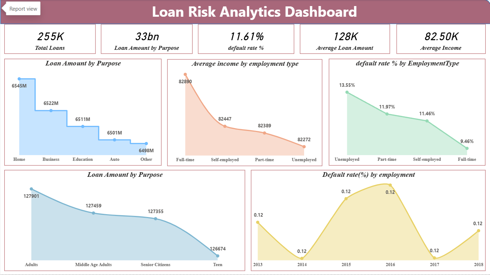
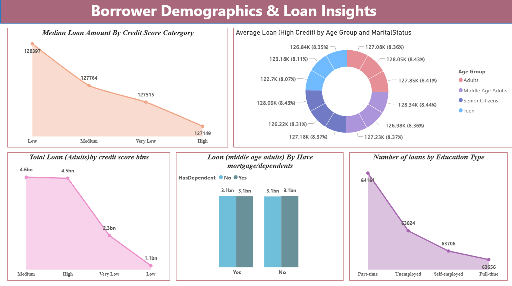
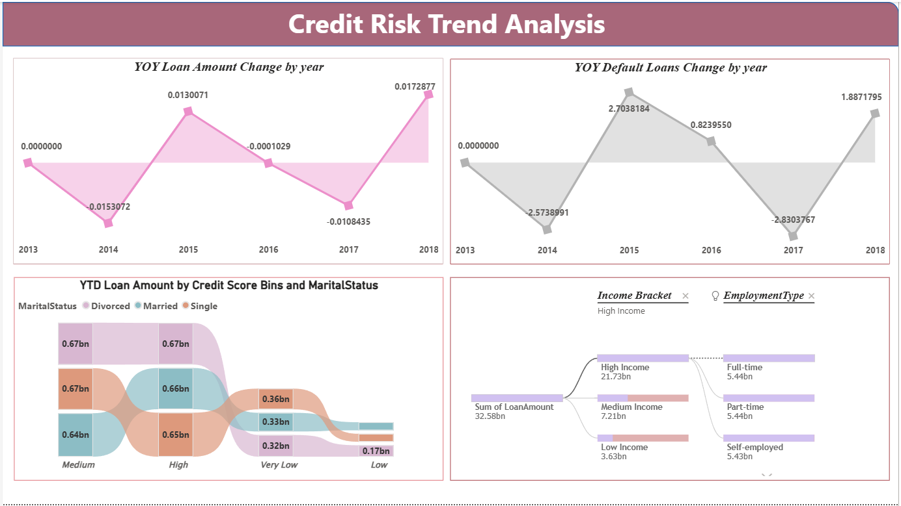

# Loan Risk Prediction - Power BI Project

## 📌 Project Overview
This project analyzes loan applicant data to identify risk factors and predict loan approval trends.

## 📊 Tools Used
- Power BI
- SQL
- Data Cleaning & Transformation

## 📈 Dashboard Features
- Loan Approval vs Rejection Analysis
- Risk Distribution
- Applicant Income Analysis
- Credit History Impact
- Loan Amount Trends

## 📂 Files Included
- loan-risk-prediction.pbix (Power BI Dashboard)
- loan.sql (Database Queries)

## 🎯 Objective
To help financial institutions understand loan risk patterns and improve decision-making.

## 📷 Dashboard Screenshots

### 🔹 Loan Risk Analytics Dashboard

### 🔹 Borrower Demographics & Loan Insights

### 🔹 Credit Risk Trend Analysis

